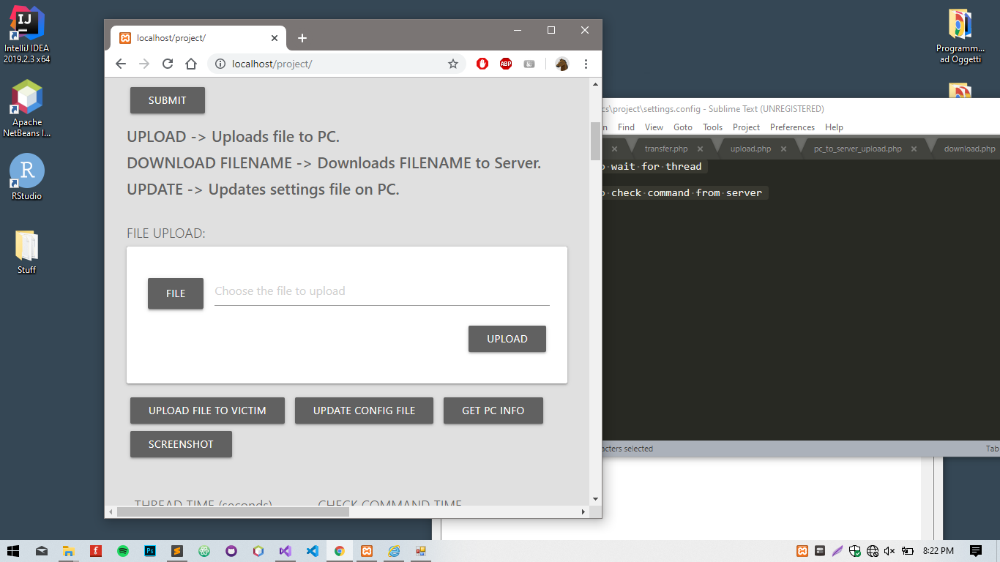

# http-Remote-Access-Tool
 RAT based on http protocol. Server written in php, client(victim) written in vb.net. Execute remote commands from server to the vb.net client listening for a command from the url. The command can be a powershell script or a batch script.

### Screenshot - Example

##### You can create your own powershell scripts and put them inside the plugins folder.

#### Note
The source code is only for the server-side. You can simply implement the client by checking periodically the server route for a probable sent command. I had implemeted the client, but I lost all the project files after a system crash.